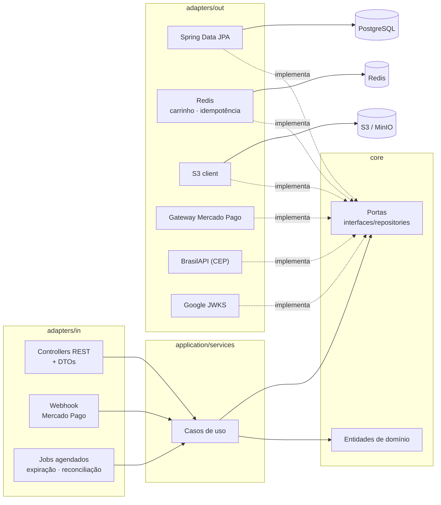
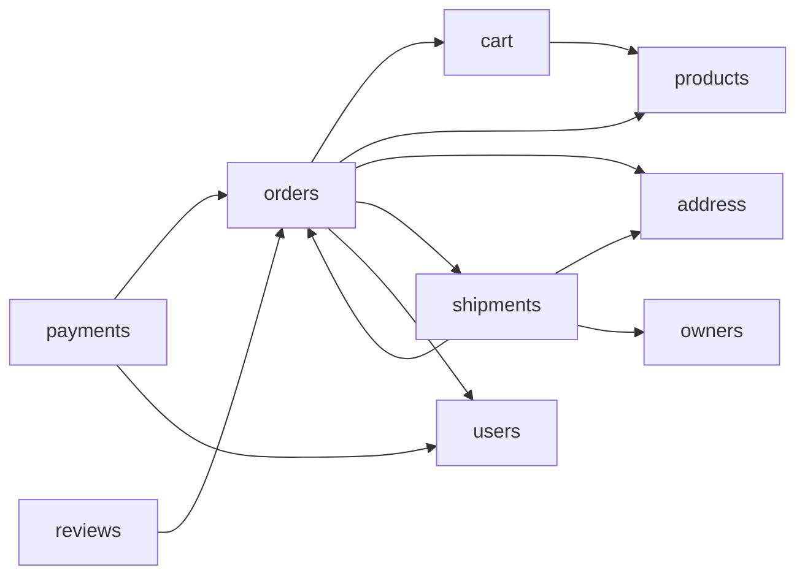

# MiniEcommerce

[](https://github.com/TiagoAReiz/MiniEcommerce-Spring-boot/actions/workflows/ci.yml)


Loja online de dono único: catálogo, carrinho, checkout, pagamento pelo Mercado Pago, envio
e avaliação. Spring Boot 4 sobre Postgres, Redis e um bucket S3, em arquitetura hexagonal
com um módulo por agregado.

**139 testes de integração** rodando contra Postgres, Redis e MinIO reais — sem mock de
infraestrutura, mais 13 unitários que não precisam de nada de pé.

---

## Stack

| | |
|---|---|
| Spring Boot | 4.1.1 (Java 17) |
| Banco | PostgreSQL 17 + Flyway |
| Cache, carrinho e idempotência | Redis 7 |
| Imagens | S3 — MinIO em desenvolvimento |
| Pagamento | Mercado Pago Checkout Pro |
| Autenticação | Google Sign-In → JWT próprio (HS256) |
| Frete | BrasilAPI (CEP → coordenadas) |
| Documentação | OpenAPI 3 / Swagger UI |

---

## Subindo

```bash
cp .env.example .env          # preencha o que estiver vazio
docker compose up -d db redis minio   # só a infraestrutura; sem nomes, sobe o app também

set -a && . ./.env && set +a  # o compose lê o .env sozinho; a aplicação não
./mvnw spring-boot:run
```

- API: `http://localhost:8080`
- Swagger UI: `http://localhost:8080/swagger-ui.html`
- Console do MinIO: `http://localhost:9001`

O bucket de imagens é criado no primeiro boot, e o Flyway aplica as migrations sozinho.

### Front-end (Next.js)

A loja e o painel do dono ficam em [`frontend/`](frontend/):

```bash
cd frontend
npm ci
NEXT_PUBLIC_API_BASE=http://localhost:8080 \
NEXT_PUBLIC_GOOGLE_CLIENT_ID=<o mesmo GOOGLE_CLIENT_ID da API> \
npm run dev                   # http://localhost:3000
```

`NEXT_PUBLIC_API_BASE` já tem `http://localhost:8080` como default; `localhost:3000` já está
em `CORS_ALLOWED_ORIGINS`.

### Em container

```bash
docker compose up -d app      # imagem multi-stage, JRE Alpine, usuário sem privilégios
```

### Rate limiting local (opcional)

```bash
docker compose --profile edge up -d nginx    # :8081 → :8080
```

Limite por IP no `/auth/`, exceção explícita para o webhook, 429 em `problem+json`.

---

## O que precisa estar preenchido

Tudo tem default de desenvolvimento, menos estas. Todas **falham fechadas**: vazias, o
recurso recusa em vez de liberar.

| variável | sem ela |
|---|---|
| `GOOGLE_CLIENT_ID` | nenhum login passa — a claim `aud` não bate |
| `JWT_SECRET` | sobe com placeholder; em uso real é falha grave |
| `MP_ACCESS_TOKEN` | não é possível abrir cobrança |
| `MP_WEBHOOK_SECRET` | toda notificação é rejeitada com 401 |

`MP_NOTIFICATION_URL` precisa ser alcançável da internet — em desenvolvimento, um túnel
apontando para `/webhooks/mercado-pago`.

---

## Arquitetura

Um módulo por agregado, cada um hexagonal. O `core` não conhece Spring Data, JPA nem HTTP;
adaptadores implementam as portas que ele declara.

```
modules/<módulo>/
├── adapters/
│   ├── in/{controllers,dtos}          entrada HTTP
│   ├── mappers/                       entidade JPA ↔ domínio
│   └── out/repositories/              Spring Data + adaptador da porta
│       └── entities/                  @Entity
├── application/services/              casos de uso
└── core/
    ├── entities/                      domínio, sem anotação de framework
    ├── exceptions/
    └── interfaces/repositories/       as portas
```

Módulos: `address` `auth` `cart` `orders` `owners` `payments` `products` `reviews`
`shipments` `users`.



Dependências entre módulos na camada de aplicação (`auth` omitido — quase todos usam o
usuário corrente):



**Agregados se referenciam por id, não por objeto.** `Order` tem `userId`, não `User`. O
`orders/core` não importa nada de `users/core` — o preço é uma consulta a mais, o ganho é
independência entre módulos.

---

## Decisões que valem conhecer

### Estoque: o banco arbitra, não o Java

Ler estoque, validar em Java e gravar o resultado perde corrida. Duas transações leem a
última unidade, ambas aprovam, ambas gravam o mesmo valor absoluto — e nada parece errado
depois: o estoque fica num número plausível enquanto existem dois pedidos para um item.

```sql
update products
   set stock = stock - :quantity,
       active = case when stock - :quantity = 0 then false else active end
 where id = :productId and active = true and stock >= :quantity
```

O `stock >= :quantity` no `WHERE` fecha a janela: a segunda transação reavalia depois do
commit da primeira, não encontra linha, e o checkout responde 409.

### Webhook: confirma rápido, processa depois

Confirmar um pagamento significa chamar a API do Mercado Pago — segundos. Fazer isso antes
de responder faz o provedor desistir e reenviar, e uma tempestade de redelivery é pior que
uma liquidação tardia.

O handler valida a assinatura, responde **200 em milissegundos** e processa em background.

Três defesas na entrada:

1. **Assinatura HMAC-SHA256** conferida em tempo constante, antes de qualquer coisa. Sem
   segredo configurado, rejeita — o endpoint é público e liquida pedidos.
2. **A notificação é pista, não prova.** O pagamento é relido do gateway; só `approved`
   liquida.
3. **Idempotência** por `SETNX` no Redis, com a marca **devolvida em caso de falha** — sem
   isso, um erro passageiro faria toda retentativa ser descartada como duplicata e o pedido
   pago ficaria `PENDING` para sempre.

### Reconciliação de pagamento

Como o webhook responde 200 antes de processar, o provedor não reenvia por conta própria.
Uma varredura periódica pergunta ao gateway sobre cobranças abertas e nunca liquidadas,
pelo `external_reference` que enviamos ao abrir.

A janela tem duas pontas: a mínima ignora cobranças recentes demais, a máxima para de
consultar carrinho abandonado. O lote pega as **mais recentes primeiro** — abandonadas se
acumulam e sufocariam justamente a cobrança onde há um cliente esperando.

### 404 no lugar de 403

Pedido, endereço e carrinho de outra pessoa respondem **404**. Um 403 confirmaria que aquele
id existe, permitindo enumerar pedidos alheios. Onde a existência já é pública — produto,
avaliação — 403 é o correto.

### Preço congelado no item do pedido

`order_items.unit_price` guarda o valor no momento da compra. Sem isso, mudar o preço de um
produto reescreveria o histórico de todos os pedidos antigos.

O checkout também **recusa** se o preço mudou desde que o item entrou no carrinho: um
carrinho vive sete dias no Redis, e ninguém deve ser cobrado por um valor que não aceitou.

### Carrinho fora da transação

O carrinho vive no Redis com TTL de sete dias. Ele é apagado **depois** do commit do
checkout — o Redis não faz rollback junto com o Postgres, e apagar antes faria um checkout
falho custar o carrinho ao cliente.

### Frete medido por distância, congelado no pedido

O frete é a distância entre o CEP de origem da loja e o CEP do endereço de entrega, corrigida
por um fator rodoviário — a linha reta entre duas coordenadas fica cerca de um terço abaixo do
trajeto real — e multiplicada por um preço por quilômetro.

**A origem vive em `owners.origin_zip_code`, não em configuração.** Quem muda o endereço da
loja é o operador, por `PUT /owners/origin`, e uma variável de ambiente transformaria uma
decisão de negócio em redeploy. A coluna nasce nula, porque a migration que semeia o dono tem
o e-mail dele e mais nada — e nulo significa **origem ainda não configurada**.

**Sem origem, o checkout recusa.** Todo pedido tem frete, então uma loja que não sabe medir a
distância não vende: `POST /orders` responde 409 `SHIPPING_ORIGIN_NOT_CONFIGURED` até o
operador definir o CEP. A alternativa — entregar de graça enquanto ninguém configurou — é o
erro que ninguém percebe, porque cada pedido isolado parece perfeitamente normal e a conta só
aparece na contabilidade. Falha fechada, no mesmo espírito dos segredos que esta API exige.

**A cotação é congelada em `orders.shipping_cost`**, pelo mesmo motivo que
`order_items.unit_price` é congelado: ela vem de uma consulta a terceiro que pode responder
diferente amanhã, ou não responder. Recalcular na leitura faria o valor devido mudar depois
que o cliente concordou com ele. `Order.totalWith` soma mercadoria e frete em um único lugar,
por onde passam tanto a resposta da API quanto o valor mandado ao gateway — um pedido que
mostra entrega na tela e cobra sem ela viajaria de graça até a contabilidade perceber.

**`orders.shipping_distance_km` é nullable, e o nulo carrega significado.** Linha com custo e
sem distância foi cobrada pela tarifa fixa de contingência, aplicada quando o lookup de CEP
falhou. É essa distinção que permite explicar uma cobrança a quem contesta, e contar com que
frequência o fallback dispara, sem gastar uma coluna booleana. As coordenadas de um CEP ficam
em cache no Redis por 30 dias — um CEP não muda de lugar, e o cache é o que impede que uma
instabilidade do provedor seja sentida na maioria dos pedidos.

**A cotação acontece fora da transação do checkout.** O `CheckoutService` cota primeiro e só
então chama o `OrderPlacementService`, que é quem abre a transação. O pool tem cinco conexões:
segurar uma entre o `BEGIN` e o `COMMIT` esperando um serviço público de CEP deixaria um
provedor lento travar quem está apenas navegando o catálogo.

### Owner reivindicado por e-mail

O dono é semeado por migration com e-mail e sem `google_sub`, que só existe depois do
primeiro login. Duas travas protegem a posse da loja: o e-mail precisa estar **verificado
pelo Google**, e uma linha que já tem `google_sub` nunca é reapontada.

### Produto se aposenta, não é apagado

`order_items` referencia produto com `RESTRICT`. `DELETE /products/{id}` desativa e responde
204 — apagar destruiria histórico de pedido. Estoque zerado também desativa sozinho.

---

## Segurança

Bearer token com TTL de 1h, emitido a partir de um ID token do Google.

**A claim `aud` é validada contra o nosso client id.** Sem essa checagem, um token legítimo
do Google emitido para o aplicativo de outra pessoa entraria aqui como aquele `sub`. Um
`OAuth2TokenValidator` dedicado cobre isso, com teste próprio.

CSRF desativado **de propósito**: a autenticação é header `Authorization`, não cookie, então
o navegador não anexa credencial sozinho. Se um dia entrar cookie ou sessão, tem que voltar.

CORS com origens listadas explicitamente, `Location` exposto (senão o front não lê o id do
que acabou de criar) e credenciais desligadas.

Nenhuma rota aceita `userId` no corpo ou na URL para identificar o chamador — sai sempre do
token. Por isso as rotas são `/users/me/...`.

---

## Banco

| migration | o que faz |
|---|---|
| `V1__init` | 10 tabelas, FKs, índices e índices únicos parciais |
| `V2__owner_seed_product_active_order_status` | `products.active`, `owners.google_sub` nullable, owner semeado, check de status |
| `V3__order_address` | `orders.address_id` |
| `V4__order_expiration` | `orders.expires_at` + índice parcial da varredura |
| `V5__shipping` | `owners.origin_zip_code`, `orders.shipping_cost` e `orders.shipping_distance_km` |
| `V6__product_catalog_data` | `products.category`, `products.highlights` e `products.specs` (JSONB) |

Três índices únicos parciais carregam regra de negócio que o código não precisa repetir:

```sql
uq_addresses_primary      -- um endereço principal por usuário
uq_product_photos_cover   -- uma capa por produto
reviews.order_item_id     -- uma avaliação por item comprado
```

`ck_orders_status` espelha o enum `OrderStatus`: o enum recusa a transição, o banco recusa o
valor.

```
PENDING ──▶ PAID ──▶ SHIPPED ──▶ DELIVERED
   │         │
   └──▶ CANCELLED ◀┘
```

`CANCELLED` devolve o estoque e reativa o produto que tinha esgotado.

### Reserva de estoque com prazo

O checkout baixa o estoque antes de existir cobrança — necessário, senão dois clientes compram
a mesma última unidade. O preço disso é que um pedido abandonado segura a prateleira, e a
reconciliação de pagamento não ajuda: ela só enxerga cobranças que chegaram a ser abertas.

`orders.expires_at` é gravado no checkout (30 min), esticado ao abrir a cobrança (24 h, o
mesmo alcance da reconciliação — cancelar antes devolveria ao estoque um pedido prestes a ser
aprovado) e apagado quando o pedido sai de `PENDING`.

A varredura que vence a reserva **mantém** a data. É isso que separa um pedido abandonado de
um cancelado à mão, e o que faz a coluna virar histórico de venda perdida: junto com os
`order_items`, fica registrado o que o cliente ia levar e por quanto.

---

## Testes

```bash
./mvnw test                          # precisa dos containers de pé
./mvnw test -Dtest=CheckoutTest
```

No CI ([`.github/workflows/ci.yml`](.github/workflows/ci.yml)) é o mesmo caminho: sobe
`db`, `redis` e `minio` pelo próprio `docker-compose.yaml`, espera os healthchecks e roda
`./mvnw verify` — nada de banco em memória nem infraestrutura simulada.

139 testes contra infraestrutura real. Sem mock de repositório: os bugs que apareceram nesta
base — `@Cacheable` estourando com `Optional.empty()`, carrinho sobrevivendo a rollback,
índice único de capa, venda dupla sob concorrência — nenhum apareceria com repositório
mockado.

**Valores únicos por execução são obrigatórios.** O banco de desenvolvimento é compartilhado
entre rodadas, e literal em coluna única já quebrou teste três vezes: CPF, e-mail e
`mercado_pago_id`. Use `UUID.randomUUID()` ou o gerador em `testsupport/Cpfs.java`.

---

## API

O contrato completo — payloads, autorização e os erros que cada rota produz — está em
[`docs/api-contracts.md`](docs/api-contracts.md).

Com a aplicação de pé, o Swagger UI é a referência viva: `http://localhost:8080/swagger-ui.html`

39 operações em 25 caminhos. Erros em `application/problem+json` (RFC 9457), com `code`
estável onde o cliente precisa reagir a um caso específico.

---

## O que falta

- **Login real com Google** nunca foi exercitado de ponta a ponta — precisa do front
  chamando o Identity Services. A validação do JWT próprio está coberta.
- **`GET /owners/me`** não existe. O `OwnerController` cobre só a origem do frete
  (`/owners/origin`): não há rota que devolva o perfil do dono, nem como zerar a origem
  depois de definida — o corpo do `PUT` exige um CEP.
- **Sem revogação de token** — o TTL de 1h é o único limite. Logout imediato pediria uma
  denylist de `jti` no Redis.
- **`email_verified` não é exigido** para cliente comum; só o caminho de owner verifica.
- **Rate limiting por conta** não existe. Hoje as constraints do banco cobrem os abusos que
  importam; passa a fazer sentido se entrar endpoint caro por chamada ou vários vendedores.
